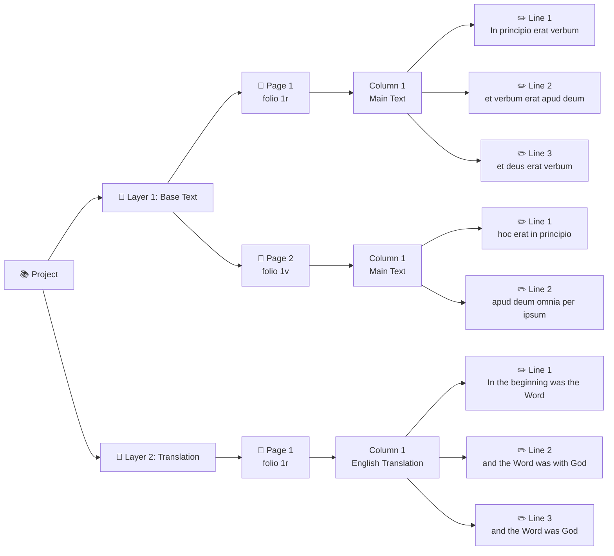

## Introduction: Your Transcription Workspace

When you work in TPEN 3, you are contributing to a network of interconnected data that follows global standards. Understanding how these pieces fit together helps you organize complex manuscripts, collaborate effectively, and make your work reusable beyond TPEN.

This guide explains the five core concepts you'll work with every day: **Projects**, **Layers**, **Pages**, **Columns**, and **Lines**. We'll also explore how **IIIF resources** interact behind the scenes.

---

## The Five Core Concepts

### Projects: Your Workspace Container

A **Project** is your primary workspace in TPEN 3. It's where everything comes together:

**What's in a Project:**

- **Title and description** - Help others understand what you're transcribing
- **Team members** - Owners, Leaders, Contributors, and Viewers with specific permissions
- **Layers** - The different types of annotations you're creating
- **Settings** - Your preferred interfaces, custom tools, and workflow options
- **IIIF Manifest** - The source of images you're working on

**Only what fits:** Instead of duplicating data, your Project is a container that references all your Layers, Pages, and Lines. The actual transcription data lives on RERUM and the original images stay with the hosting repository.

**Creating Projects:** You can start a Project from:

- A single image or collection of images
- A IIIF Manifest from any online source
- An existing TPEN 2.8 project
- A IIIF Collection (multiple manuscripts)

[Learn more about starting projects →](/tutorials/2022/07/02/start-a-project.html)

### Layers: Organizing Different Types of Annotations

**Layers** let you separate different kinds of transcriptions or annotations on the same manuscript. Each Layer is a distinct "track" of work.

**Common Layer Examples:**

- **Base text** - The primary text of the manuscript
- **Marginal notes** - Commentary or glosses in the margins
- **Translation layer** - Modern language translation alongside the original
- **Paleographic notes** - Observations about letter forms or scribal hands
- **Commentaries and Glosses** - Additional scholarly notes or explanations
- **Musical notation** - Transcriptions of musical elements in manuscripts

**Don't overthink it:** Many Projects only have one Layer. This is an additional option to organize multiple types of annotations, control text flow, and manage complex manuscripts.

**Technical Detail:** Each Layer is published as a [Web Annotation Collection](https://www.w3.org/TR/annotation-model/#annotation-collection), making it reusable in any tool that supports the standard.

**Working with Layers:**

- Most projects start with one Layer (your base transcription)
- Add more Layers through Project Management when needed
- Switch between Layers in the transcription interface
- Each Layer can have different text flow and organization

### Pages: Individual Manuscript Folios

A **Page** in TPEN 3 represents one image from your manuscript, typically a single folio recto or verso, though it could be any image resource. Epigraphy, printed books, paintings... anything that can be photographed and annotated.

**What defines a Page:**

- **One image** - Each Page links to exactly one Canvas (image) from your IIIF Manifest
- **Columns** - The sections or text blocks within that image
- **Lines** - The individual text fragments you're transcribing
- **Position in sequence** - Pages are ordered for continuous text flow

**Multi-Layer Pages:** The same physical folio can appear in multiple Layers. For example, if your manuscript has both main text and marginal commentary, you might have:

- Page 1 (Base Text Layer) - containing just the main text lines
- Page 1 (Commentary Layer) - containing just the marginal notes

This separation keeps your work organized without duplication and allows text in each Layer to flow logically.

**Technical Detail:** Each Page is stored as an [Annotation Page](https://www.w3.org/TR/annotation-model/#annotation-page), containing all the line annotations for one Canvas in one Layer.

### Columns: Sections Within a Page

**Columns** (also called "groups" or "sections") organize the Lines on a Page into logical units.

**Common Column Uses:**

- **Text columns** - Left and right columns in a two-column manuscript
- **Text blocks** - Different sections of a complex layout
- **Reading order groups** - Sections that should be read as units

**Think of it like:** Dividing a newspaper page into articles. Each Column is a coherent section with its own internal line order and a defined place in the overall reading sequence.

**How Columns Work:**

- Define the reading order *between* groups (which Column comes first)
- Lines within each Column follow their own sequence

### Lines: Your Individual Transcriptions

**Lines** are where your actual transcription work happens. Each Line is a single annotation connecting:

- **A text fragment** - The actual transcription you type
- **An image region** - The specific area on the page (x, y, width, height coordinates in our core experience)
- **Metadata** - Who created it, when, and its position in the reading order

**What makes a Line:**

- **Target** - The exact fragment on the manuscript image
- **Body** - Your transcription text
- **Order** - Its sequence within the Column
- **Author** - Who created or modified it
- **Timestamp** - When it was created/modified

**Line Granularity:** You decide what constitutes a "line":

- Physical lines of text (most common)
- Abbreviated sections for quick markup
- Individual words or glyphs for detailed paleographic work
- Text fragments of any size

**Technical Detail:** Each Line is a [Web Annotation](https://www.w3.org/TR/annotation-model/) targeting a region of a IIIF Canvas and containing your text as its body and attributed to you.

---

## How It All Fits Together

Here's how these concepts nest within each other:



**Typical Workflow:**

1. **Create a Project** from your manuscript images or IIIF Manifest
2. **Work on Pages** one at a time in the transcription interface
3. **Mark Lines** by drawing boxes around text fragments
4. **Group into Columns** if your page has multiple sections
5. **Type transcriptions** for each Line
6. **Add Layers** if you need to annotate the same pages differently
7. **Set reading order** so your text flows correctly across Pages and Columns

---

## IIIF Resources: The Foundation

TPEN 3 is built on the [IIIF](https://iiif.io/) (International Image Interoperability Framework) standard, which powers how images and transcriptions work together.

### Manifests: Organizing Your Images

A **IIIF Manifest** is like a table of contents for a digitized manuscript. It describes:
- What images are in the manuscript
- What order they appear in
- Metadata like title, author, date, rights
- How images relate to physical structure (pages, folios)

**Three Ways TPEN Uses Manifests:**

#### 1. Starting a Project

When you create a Project from a IIIF Manifest:
- TPEN reads the Manifest to discover all the images
- Each Canvas (image) in the Manifest becomes a Page
- The Manifest's order determines the initial Page sequence
- Metadata populates your Project description

**Example:** A medieval manuscript Manifest from the Bodleian Library might contain 200 Canvases representing 100 folios (recto and verso). TPEN imports all 200 as Pages, ready for transcription.

**Where to find Manifests:**
- Most major digital libraries (Bodleian, Gallica, Internet Archive, etc.)
- Look for "IIIF" or "Share/Export" options on manuscript viewer pages
- URLs typically end with `/manifest` or `/manifest.json`

#### 2. Providing Image Targets

TPEN doesn't copy or download images. Instead:
- Your Line annotations **target** the original images in the Manifest
- Images stay on the library's server
- Annotations point to specific x,y,w,h coordinates on each Canvas
- Anyone viewing your annotations sees the original, authoritative images

**Benefits:**
- No duplicate storage
- Images benefit from the library's infrastructure (zoom, color correction)
- Annotations remain valid even if image quality improves
- You're citing the original source, not a copy

#### 3. Exporting as a Derivative

You can export your complete Project as a new IIIF Manifest that includes:
- All the original image information
- Your transcription annotations embedded
- Metadata from your Project
- Reading order reflecting your Columns and Pages

**Uses for exported Manifests:**
- Share your work in IIIF viewers like Mirador or Universal Viewer
- Deposit in digital repositories
- Enable text search in image viewers
- Reuse in other scholarly tools
- Create datasets for computational analysis

**Example:** After transcribing a medieval recipe book, you export a Manifest. Researchers can now:
- View the manuscript images
- See your transcriptions overlaid on the images
- Search the full text across all pages
- Download the data for analysis
- All in standard IIIF-compatible tools

### Canvases: Individual Image Resources

A **Canvas** is one image in a IIIF Manifest. It represents the "drawable surface" where content appears.

**What you need to know:**
- Each Page in TPEN links to one Canvas
- Canvases have dimensions (width and height in pixels)
- Your Line annotations use these dimensions to specify locations
- Canvases can have multiple images (e.g., multispectral imaging) - you annotate the Canvas, not individual images

**Technical Detail:** When you draw a box around a Line, TPEN creates an annotation targeting that Canvas with coordinates like: `canvas#xywh=100,200,300,50` (starting at x:100, y:200, width:300, height:50).

### Images: Left in Place

One of TPEN 3's key principles: **images are not migrated or copied**.

**How it works:**
- Libraries host their images on their servers
- IIIF Manifests point to these images
- TPEN loads images directly from the source
- Your browser retrieves images as needed
- Annotations reference the image URLs

**Advantages:**
- **No storage costs** - TPEN doesn't duplicate large image files
- **Always current** - If libraries update images, you see improvements
- **Proper attribution** - Clear connection to the original source
- **Better performance** - Libraries use CDNs and image servers optimized for delivery

**What about access control?** 
- If you can see the images in your browser, you can annotate them
- Images behind authentication, CORS restrictions, or firewalls will work for you
- Sharing your Project may require recipients to have access to the same images
- Public IIIF resources work best for collaborative projects

### IIIF and Standards Compliance

Every piece of data TPEN creates follows international standards:

- **Projects** → Custom TPEN format, accessible via API
- **Layers** → Web Annotation Collections
- **Pages** → Web Annotation Pages  
- **Lines** → Web Annotations
- **Manifests** → IIIF Presentation 3.0

**Why this matters:**
- Your work isn't locked into TPEN
- Other tools can read your annotations
- Your data is citable and preservable
- Future tools will still understand your work
- You can combine TPEN data with other sources

---

## Working with Your Data

### In the Transcription Interface

When you transcribe, you're working with all five concepts simultaneously:

1. **Select a Page** - Choose which folio to work on
2. **Choose your Layer** - Switch between base text, commentary, etc.
3. **Mark Lines** - Draw boxes around text on the image
4. **Group into Columns** - Organize Lines into sections (if needed)
5. **Set reading order** - Define sequence of Columns and Lines
6. **Type transcriptions** - Enter text for each Line

The interface handles the technical details of creating proper Web Annotations, targeting IIIF Canvases, and storing everything correctly.

### Via the API

Developers can access your data programmatically:

```javascript
// Get a Project
fetch('https://api.t-pen.org/project/abc123')

// Get a Layer (Annotation Collection)
fetch('https://store.rerum.io/v1/id/layer456')

// Get a Page (Annotation Page)  
fetch('https://store.rerum.io/v1/id/page789')

// Get individual Line annotations
// (contained within the Annotation Page)
```

[Learn more in the API documentation →](/api/)

### In Other Tools

Because TPEN uses standards, your data works elsewhere:

- **IIIF Viewers** (Mirador, Universal Viewer) - Display images with transcription overlays
- **TEI Editors** - Export annotations as TEI XML
- **Research platforms** - Query annotations as Linked Data
- **Computational tools** - Analyze transcription text and metadata
- **Digital repositories** - Deposit complete IIIF Manifests with annotations

---

## Key Takeaways

**For Daily Work:**
- **Projects** contain everything for one manuscript
- **Layers** separate different annotation types
- **Pages** represent individual images/folios  
- **Columns** organize complex layouts
- **Lines** hold your actual transcriptions

**For Understanding IIIF:**
- **Images** stay at the source - you annotate remotely
- **Manifests** organize images and can start Projects
- **Canvases** are the image surfaces you annotate
- **Export Manifests** to reuse your work elsewhere

**The Power of Standards:**
- Your work is portable, not locked in
- Other tools can read and use your annotations
- Data remains accessible long-term
- Easy to combine with other resources

---

## Next Steps

**Get Started:**
- [Create your first Project](/tutorials/2022/07/02/start-a-project.html)
- [Learn transcription workflows](/tutorials/2022/07/03/transcribing.html)
- [Understand roles and permissions](/announcements/2024/12/20/roles-permissions.html)

**Go Deeper:**
- [Developing Transcription Interfaces](/tutorials/2022/07/05/developing-transcription-interfaces.html) - Technical deep dive
- [TPEN API Documentation](/api/) - Programmatic access
- [IIIF Presentation 3.0 Spec](https://iiif.io/api/presentation/3.0/) - Standard details
- [Web Annotation Model](https://www.w3.org/TR/annotation-model/) - Annotation standard

**Questions?**
- [Join the discussion](https://github.com/CenterForDigitalHumanities/TPEN3/discussions)
- [Review API documentation](/api/)
- [Explore the knowledge base](/tutorials/)
