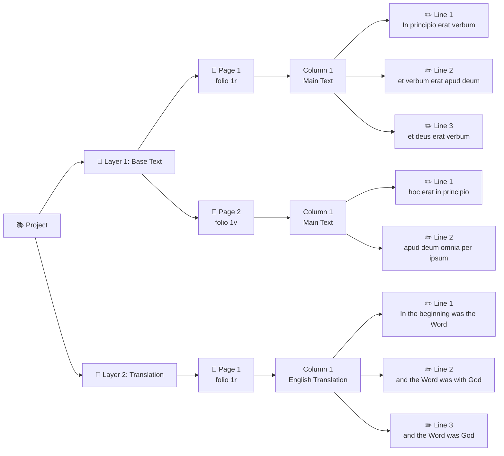
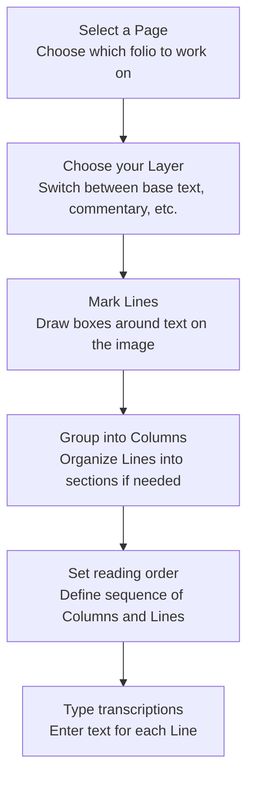

## Introduction: Your Transcription Workspace

When you work in TPEN 3, you are contributing to a network of interconnected data that follows global standards. Understanding how these pieces fit together helps you organize complex manuscripts, collaborate effectively, and make your work reusable beyond TPEN.

This guide explains the five core concepts you'll work with every day: **Projects**, **Layers**, **Pages**, **Columns**, and **Lines**. We'll also explore how **IIIF resources** interact behind the scenes.

---

## The Five Core Concepts

### Projects: Your Workspace Container

A **Project** is your primary workspace in TPEN 3. It's where everything comes together:

**What's in a Project:**

- **Title and description** - Help others understand what you're transcribing
- **Team members** - Owners, Leaders, Contributors, and Viewers with specific permissions
- **Layers** - The different types of annotations you're creating
- **Settings** - Your preferred interfaces, custom tools, and workflow options
- **IIIF Manifest** - The source of images you're working on

**Only what fits:** Instead of duplicating data, your Project is a container that references all your Layers, Pages, and Lines. The actual transcription data lives on RERUM and the original images stay with the hosting repository.

**Creating Projects:** You can start a Project from:

- A single image or collection of images
- A IIIF Manifest from any online source
- An existing TPEN 2.8 project
- A IIIF Collection (multiple manuscripts)

[Learn more about starting projects →](/tutorials/2022/07/02/start-a-project.html)

### Layers: Organizing Different Types of Annotations

**Layers** let you separate different kinds of transcriptions or annotations on the same manuscript. Each Layer is a distinct "track" of work.

**Common Layer Examples:**

- **Base text** - The primary text of the manuscript
- **Marginal notes** - Commentary or glosses in the margins
- **Translation layer** - Modern language translation alongside the original
- **Paleographic notes** - Observations about letter forms or scribal hands
- **Commentaries and Glosses** - Additional scholarly notes or explanations
- **Musical notation** - Transcriptions of musical elements in manuscripts

**Don't overthink it:** Many Projects only have one Layer. This is an additional option to organize multiple types of annotations, control text flow, and manage complex manuscripts.

**Technical Detail:** Each Layer is published as a [Web Annotation Collection](https://www.w3.org/TR/annotation-model/#annotation-collection), making it reusable in any tool that supports the standard.

**Working with Layers:**

- Most projects start with one Layer (your base transcription)
- Add more Layers through Project Management when needed
- Switch between Layers in the transcription interface
- Each Layer can have different text flow and organization

### Pages: Individual Manuscript Folios

A **Page** in TPEN 3 represents one image from your manuscript, typically a single folio recto or verso, though it could be any image resource. Epigraphy, printed books, paintings... anything that can be photographed and annotated.

**What defines a Page:**

- **One image** - Each Page links to exactly one Canvas (image) from your IIIF Manifest
- **Columns** - The sections or text blocks within that image
- **Lines** - The individual text fragments you're transcribing
- **Position in sequence** - Pages are ordered for continuous text flow

**Multi-Layer Pages:** The same physical folio can appear in multiple Layers. For example, if your manuscript has both main text and marginal commentary, you might have:

- Page 1 (Base Text Layer) - containing just the main text lines
- Page 1 (Commentary Layer) - containing just the marginal notes

This separation keeps your work organized without duplication and allows text in each Layer to flow logically.

**Technical Detail:** Each Page is stored as an [Annotation Page](https://www.w3.org/TR/annotation-model/#annotation-page), containing all the line annotations for one Canvas in one Layer.

### Columns: Sections Within a Page

**Columns** (also called "groups" or "sections") organize the Lines on a Page into logical units.

**Common Column Uses:**

- **Text columns** - Left and right columns in a two-column manuscript
- **Text blocks** - Different sections of a complex layout
- **Reading order groups** - Sections that should be read as units

**Think of it like:** Dividing a newspaper page into articles. Each Column is a coherent section with its own internal line order and a defined place in the overall reading sequence.

**How Columns Work:**

- Define the reading order *between* groups (which Column comes first)
- Lines within each Column follow their own sequence

### Lines: Your Individual Transcriptions

**Lines** are where your actual transcription work happens. Each Line is a single annotation connecting:

- **A text fragment** - The actual transcription you type
- **An image region** - The specific area on the page (x, y, width, height coordinates in our core experience)
- **Metadata** - Who created it, when, and its position in the reading order

**What makes a Line:**

- **Target** - The exact fragment on the manuscript image
- **Body** - Your transcription text
- **Order** - Its sequence within the Column
- **Author** - Who created or modified it
- **Timestamp** - When it was created/modified

**Line Granularity:** You decide what constitutes a "line":

- Physical lines of text (most common)
- Abbreviated sections for quick markup
- Individual words or glyphs for detailed paleographic work
- Text fragments of any size

**Technical Detail:** Each Line is a [Web Annotation](https://www.w3.org/TR/annotation-model/) targeting a region of a IIIF Canvas and containing your text as its body and attributed to you.

---

## How It All Fits Together

Here's how these concepts nest within each other:



**Typical Workflow:**

1. **Create a Project** from your manuscript images or IIIF Manifest
2. **Work on Pages** one at a time in the transcription interface
3. **Mark Lines** by drawing boxes around text fragments
4. **Group into Columns** if your page has multiple sections
5. **Type transcriptions** for each Line
6. **Set reading order** so your text flows correctly across Pages and Columns
7. **Add Layers** if you need to annotate the same pages differently

---

## IIIF Resources: The Foundation

TPEN 3 is built on the [IIIF](https://iiif.io/) (International Image Interoperability Framework) and [Web Annotation](https://www.w3.org/TR/annotation-model/) standards, linking images and transcriptions together.

### Manifests: Organizing Your Images

A **IIIF Manifest** is a container for a digitized resource.  For a digitized manuscript it describes:

- What images are in the manuscript
- What order they appear in
- Metadata like title, author, date, rights
- How images relate to physical structure (pages, folios)

#### Three Ways TPEN Uses Manifests

1. Start projects from existing Manifests to auto-import images, order, and metadata.
2. Target original images via Canvases; annotations reference xywh on source content (no copies).
3. Export a derivative Manifest with your annotations and reading order for reuse in other tools.

> If you're starting a new Project, TPEN creates a new Manifest for you. If you're starting from an existing Manifest, TPEN references the original one.

See the full guide: [IIIF Manifests in TPEN 3](/tutorials/2026/01/10/iiif-manifests-in-tpen3.html).

### Canvases: Individual Image Resources

A **Canvas** is one image in a IIIF Manifest. It represents the "drawable surface" where content appears.

**What you need to know:**

- Pages in TPEN link to a Canvas
- Your Line annotations target a fragment of a Canvas
- TPEN Projects are made up of Pages that reference these Canvases, they are not "part of" the Project

**Technical Detail:** When you draw a box around a Line, TPEN creates an annotation targeting that Canvas with coordinates like: `canvas#xywh=100,200,300,50` (starting at x:100, y:200, width:300, height:50).

### Images: Left in Place

One of TPEN 3's key principles: **images are not migrated or copied**.

**How it works:**

- Institutions host their images on their servers
- IIIF Manifests point to these images
- t-pen.org loads images directly from the source
- Your browser retrieves images as needed
- Line annotations reference the image URLs via the Canvas target

**Advantages:**

- **Reliability** - If institutions update images, you see improvements
- **Attribution** - Clear connection to the original source
- **Performance** - Institutions use CDNs and image servers optimized for delivery
- **Portability** - Your annotations work with any IIIF viewer and can be integrated into any IIIF workflow

**What about access control?**

- If you can see the images in your browser, you can annotate them
- Images behind authentication or paywalls can still work for *you*
- Sharing your Project may require recipients to have access to the same images
- Even with limited access, the transcription data is still yours to use and share, referencing the original images
- Public IIIF resources work best for collaborative projects

### IIIF and Standards Compliance

Every piece of data TPEN creates follows international standards and is stored at rerum.io, ensuring long-term preservation and accessibility. This means your work is not just in TPEN but also part of a broader ecosystem of digital humanities tools and platforms:

- **Projects** → Custom TPEN format, accessible via API
- **Layers** → available as Web Annotation Collections
- **Pages** → available as Web Annotation Pages  
- **Lines** → available as Web Annotations
- **Manifests** → IIIF Presentation 3.0

> - Your work isn't locked into TPEN
> - Other tools can work directly with your annotations
> - Your data is citable and preservable
> - Future tools will still understand your work
> - You can use other tools to prepare your data for TPEN

---

## Working with Your Data

### In the Transcription Interface



The interface handles the technical details of creating proper Web Annotations, targeting IIIF Canvases, and storing everything correctly.

### Via the API

Developers can access your data programmatically:

```javascript
// Get a Project
fetch('https://api.t-pen.org/project/abc123')

// Get a Layer (Annotation Collection)
fetch('https://store.rerum.io/v1/id/layer456')

// Get a Page (Annotation Page)  
fetch('https://store.rerum.io/v1/id/page789')

// Get individual Line annotations
// (contained within the Annotation Page)
```

[Learn more in the API documentation →](/api/)

### In Other Tools

Because TPEN uses standards, your data works elsewhere:

- **IIIF Viewers** (Mirador, Universal Viewer) - Display images with transcription overlays
- **TEI Editors** - Shim annotations as standoff TEI XML
- **Research platforms** - Query annotations as Linked Open Usable Data
- **Computational tools** - Analyze transcription text and metadata
- **Digital repositories** - Deposit complete IIIF Manifests with annotations or contribute supplements to existing ones

## Next Steps

**Get Started:**

- [Create your first Project](/tutorials/2022/07/02/start-a-project.html)
- [Learn transcription workflows](/tutorials/2022/07/03/transcribing.html)
- [Understand roles and permissions](/announcements/2024/12/20/roles-permissions.html)

**Go Deeper:**

- [Developing Transcription Interfaces](/tutorials/2022/07/05/developing-transcription-interfaces.html) - Technical deep dive
- [IIIF Manifests in TPEN 3](/tutorials/2026/01/10/iiif-manifests-in-tpen3.html) - Full guide to starting, targeting, and exporting
- [TPEN API Documentation](/api/) - Programmatic access
- [IIIF Presentation 3.0 Spec](https://iiif.io/api/presentation/3.0/) - Standard details
- [Web Annotation Model](https://www.w3.org/TR/annotation-model/) - Annotation standard

**Questions?**

- [Join the discussion](https://github.com/CenterForDigitalHumanities/TPEN3/discussions)
- [Review API documentation](/api/)
- [Explore the knowledge base](/category/tutorials/)
