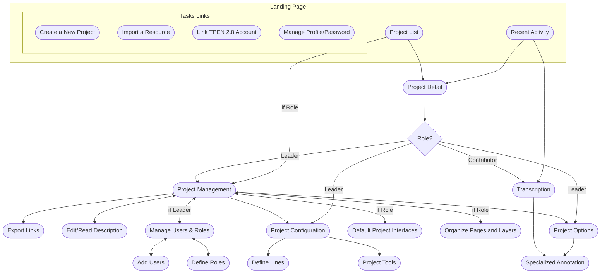
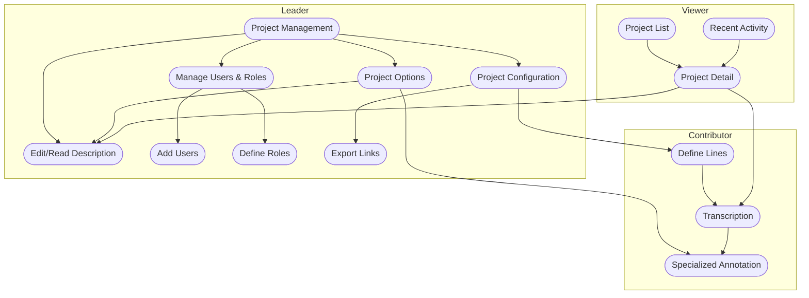
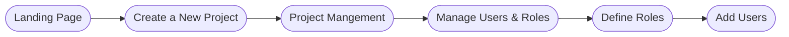
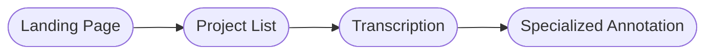

## Core Workflow Interfaces Planning

This page visualizes the core workflow interfaces in the TPEN Application. This is a work in progress and will be updated as the workflow evolves.

> **Note:** Update this chart as new interfaces or workflow steps are defined.

---

## General Roles

> **Swimlane Example:** This chart groups interfaces by user role (Leader, Contributor, Viewer) into swimlanes.

## Task Flow Summaries

### Creating a New Project and Inviting Members

This section outlines the steps a user follows to create a new project and invite members in the TPEN Application.

**Summary of Steps:**

1. User navigates to the Landing Page.
2. Selects "Create New Project".
3. Configures project details and saves the project.
4. Accesses the Project Management page.
5. Opens "Manage Users & Roles".
6. Defines any custom roles.
7. Adds members to the project with roles.
8. Sends invitations to new members.

> **Note:** This flow can be updated as new features or steps are introduced.

### Continue Transcribing an Existing Project

This section outlines the steps a user follows to continue transcribing in an existing project in the TPEN Application.

**Summary of Steps:**

1. User navigates to the Landing Page.
2. Selects a project from the Project List, clicking to transcribe.
3. Continues transcribing in the Transcription interface.
4. Optionally, adds annotations.

> **Note:** This flow can be updated as new features or steps are introduced.
