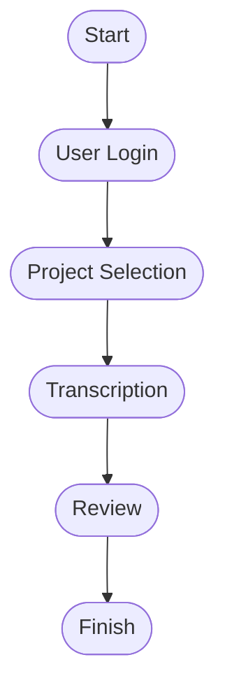

# Core Workflow Interfaces Planning

This page uses Mermaid to visualize the core workflow interfaces. This is a work in progress and will be updated as the workflow evolves.

> **Note:** Update this chart as new interfaces or workflow steps are defined.
