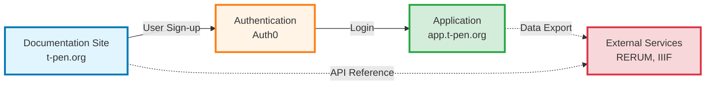
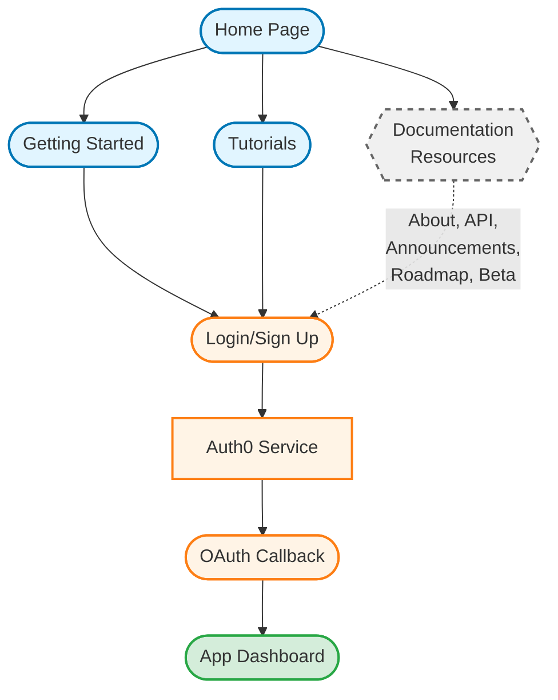
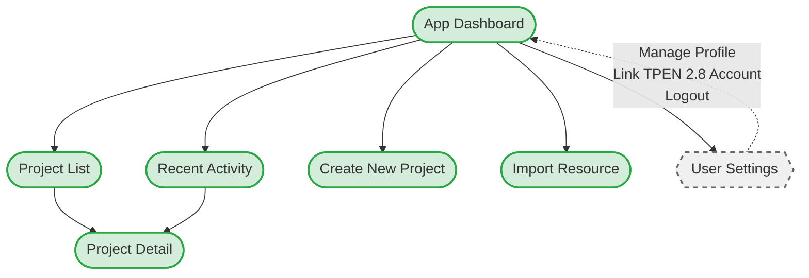
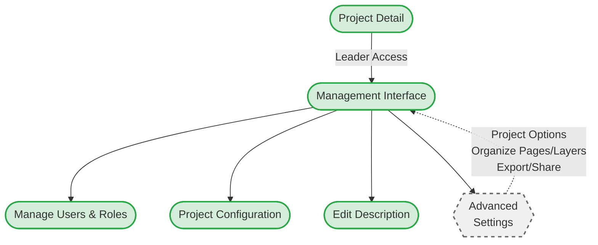
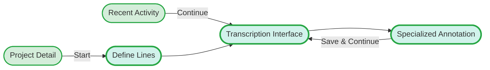
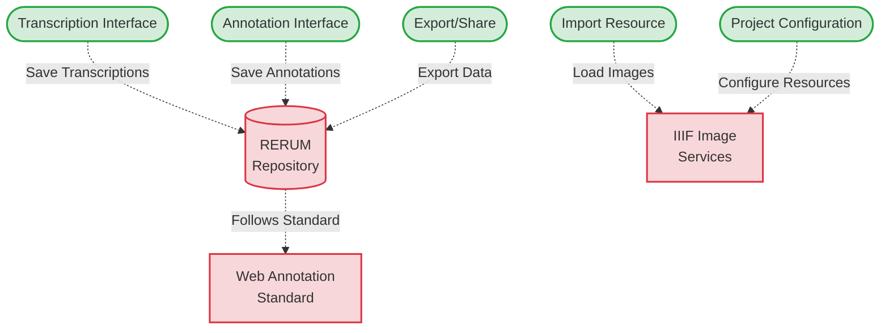
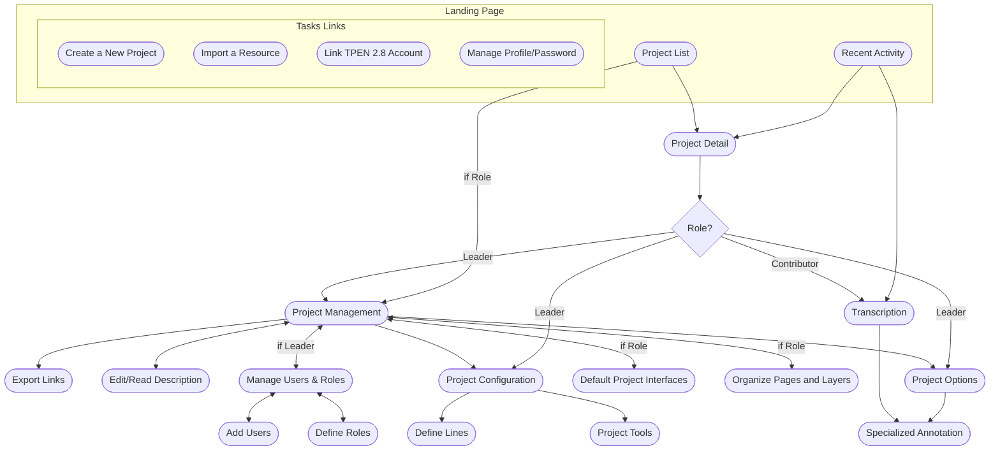
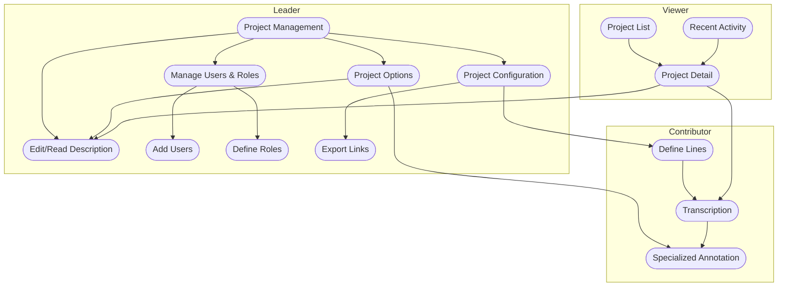
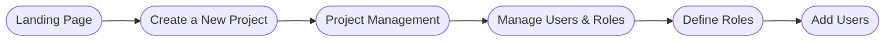
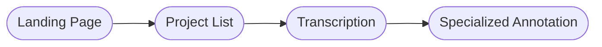

## Core Workflow Interfaces Planning

This page visualizes the core workflow interfaces in the TPEN Application. This is a work in progress and will be updated as the workflow evolves.

---

## TPEN Navigation Map

This section provides a clear visual overview of how the TPEN ecosystem components interlink. The diagrams are organized from high-level system architecture down to specific workflows.

---

### 1. System Overview

High-level view of the major TPEN components and how they connect.

```mermaid
graph LR
    Doc[Documentation Site<br/>t-pen.org]
    Auth[Authentication<br/>Auth0]
    App[Application<br/>app.t-pen.org]
    Ext[External Services<br/>RERUM, IIIF]
    
    Doc -->|User Sign-up| Auth
    Auth -->|Login| App
    App -.->|Data Export| Ext
    Doc -.->|API Reference| Ext
    
    classDef docStyle fill:#e1f5ff,stroke:#0077b6,stroke-width:3px
    classDef authStyle fill:#fff4e6,stroke:#fd7e14,stroke-width:3px
    classDef appStyle fill:#d4edda,stroke:#28a745,stroke-width:3px
    classDef extStyle fill:#f8d7da,stroke:#dc3545,stroke-width:3px
    
    class Doc docStyle
    class Auth authStyle
    class App appStyle
    class Ext extStyle
```

---

### 2. User Entry & Authentication Flow

How users access TPEN from the documentation site through authentication to the application.

```mermaid
graph TB
    %% Documentation Entry Points
    Home([Home Page])
    GettingStarted([Getting Started])
    Tutorials([Tutorials])
    
    %% Documentation Resources - clustered
    DocResources{{"Documentation<br/>Resources"}}
    
    %% Authentication
    Login([Login/Sign Up])
    Auth0[Auth0 Service]
    Callback([OAuth Callback])
    
    %% Application Entry
    AppHome([App Dashboard])
    
    %% Main Flow
    Home --> GettingStarted
    Home --> Tutorials
    Home --> DocResources
    GettingStarted --> Login
    Tutorials --> Login
    Login --> Auth0
    Auth0 --> Callback
    Callback --> AppHome
    
    %% Grouped peripheral pages
    DocResources -.->|About, API,<br/>Announcements,<br/>Roadmap, Beta| Login
    
    classDef docStyle fill:#e1f5ff,stroke:#0077b6,stroke-width:2px
    classDef authStyle fill:#fff4e6,stroke:#fd7e14,stroke-width:2px
    classDef appStyle fill:#d4edda,stroke:#28a745,stroke-width:2px
    classDef groupStyle fill:#f0f0f0,stroke:#666,stroke-width:2px,stroke-dasharray: 5 5
    
    class Home,GettingStarted,Tutorials docStyle
    class Login,Auth0,Callback authStyle
    class AppHome appStyle
    class DocResources groupStyle
```

---

### 3. Application Dashboard & Project Access

Main navigation within the app.t-pen.org dashboard.

```mermaid
graph TB
    AppHome([App Dashboard])
    
    %% Project Views
    ProjectList([Project List])
    RecentActivity([Recent Activity])
    ProjectDetail([Project Detail])
    
    %% Quick Actions
    NewProject([Create New Project])
    ImportResource([Import Resource])
    
    %% User Settings - clustered
    UserSettings{{"User Settings"}}
    
    %% Main Navigation
    AppHome --> ProjectList
    AppHome --> RecentActivity
    AppHome --> NewProject
    AppHome --> ImportResource
    AppHome --> UserSettings
    
    ProjectList --> ProjectDetail
    RecentActivity --> ProjectDetail
    
    %% Grouped peripheral actions
    UserSettings -.->|Manage Profile<br/>Link TPEN 2.8 Account<br/>Logout| AppHome
    
    classDef appStyle fill:#d4edda,stroke:#28a745,stroke-width:2px
    classDef groupStyle fill:#f0f0f0,stroke:#666,stroke-width:2px,stroke-dasharray: 5 5
    
    class AppHome,ProjectList,RecentActivity,ProjectDetail,NewProject,ImportResource appStyle
    class UserSettings groupStyle
```

---

### 4. Project Management Workflow

Interfaces for project leaders to configure and manage projects.

```mermaid
graph TB
    ProjectDetail([Project Detail])
    Management([Management Interface])
    
    %% Management Functions
    ManageUsers([Manage Users & Roles])
    ProjectConfig([Project Configuration])
    EditDesc([Edit Description])
    
    %% Additional Settings - clustered
    AdvancedSettings{{"Advanced<br/>Settings"}}
    
    ProjectDetail -->|Leader Access| Management
    Management --> ManageUsers
    Management --> ProjectConfig
    Management --> EditDesc
    Management --> AdvancedSettings
    
    %% Grouped peripheral management
    AdvancedSettings -.->|Project Options<br/>Organize Pages/Layers<br/>Export/Share| Management
    
    classDef appStyle fill:#d4edda,stroke:#28a745,stroke-width:2px
    classDef groupStyle fill:#f0f0f0,stroke:#666,stroke-width:2px,stroke-dasharray: 5 5
    
    class ProjectDetail,Management,ManageUsers,ProjectConfig,EditDesc appStyle
    class AdvancedSettings groupStyle
```

---

### 5. Core Transcription Workflow

The primary workflow for transcribing and annotating content.

```mermaid
graph LR
    ProjectDetail([Project Detail])
    RecentActivity([Recent Activity])
    
    DefineLines([Define Lines])
    Transcribe([Transcription Interface])
    Annotate([Specialized Annotation])
    
    ProjectDetail -->|Start| DefineLines
    RecentActivity -->|Continue| Transcribe
    DefineLines --> Transcribe
    Transcribe --> Annotate
    Annotate -->|Save & Continue| Transcribe
    
    classDef appStyle fill:#d4edda,stroke:#28a745,stroke-width:2px
    classDef workflowStyle fill:#d1f2eb,stroke:#28a745,stroke-width:3px
    
    class ProjectDetail,RecentActivity appStyle
    class DefineLines,Transcribe,Annotate workflowStyle
```

---

### 6. External Service Integrations

Data flow between TPEN and external services.

```mermaid
graph TB
    %% App Interfaces
    Transcribe([Transcription Interface])
    Annotate([Annotation Interface])
    ImportResource([Import Resource])
    ProjectConfig([Project Configuration])
    Export([Export/Share])
    
    %% External Services
    RERUM[(RERUM<br/>Repository)]
    IIIF[IIIF Image<br/>Services]
    WebAnnotation[Web Annotation<br/>Standard]
    
    %% Data Flow
    Transcribe -.->|Save Transcriptions| RERUM
    Annotate -.->|Save Annotations| RERUM
    Export -.->|Export Data| RERUM
    
    ImportResource -.->|Load Images| IIIF
    ProjectConfig -.->|Configure Resources| IIIF
    
    RERUM -.->|Follows Standard| WebAnnotation
    
    classDef appStyle fill:#d4edda,stroke:#28a745,stroke-width:2px
    classDef extStyle fill:#f8d7da,stroke:#dc3545,stroke-width:2px
    
    class Transcribe,Annotate,ImportResource,ProjectConfig,Export appStyle
    class RERUM,IIIF,WebAnnotation extStyle
```

---

**Navigation Guide:**

1. **System Overview**: Shows the four main components of the TPEN ecosystem
2. **User Entry & Authentication**: How users discover and access TPEN through the documentation site
3. **Application Dashboard**: Main navigation hub once users are logged in
4. **Project Management**: Administrative interfaces for project configuration
5. **Core Transcription Workflow**: The primary task flow for creating transcriptions
6. **External Integrations**: How TPEN connects with RERUM, IIIF, and Web Annotation standards

> **Legend**: Solid lines (→) indicate navigation paths, dotted lines (-.->) indicate data flow or grouped peripheral interfaces.

---

```mermaid
flowchart TD
    LandingPage([Landing Page])
    Recents([Recent Activity])
    List([Project List])
    Detail([Project Detail])
    ExportLink([Export Links])
    EditDesc([Edit/Read Description])
    Config([Project Configuration])
    Options([Project Options])
    Tools([Project Tools])
    Interfaces([Default Project Interfaces])
    Management([Project Management])
    PageLayers([Organize Pages and Layers])
    ManageUsers([Manage Users & Roles])
    AddUsers([Add Users])
    DefineRoles([Define Roles])
    Transcribe([Transcription])
    DefineLines([Define Lines])
    Annotate([Specialized Annotation])
    NewProject([Create a New Project])
    ImportResource([Import a Resource])
    LinkAccount([Link TPEN 2.8 Account])
    ManageProfile([Manage Profile/Password])

    Recents --> Detail
    Recents --> Transcribe
    subgraph LandingPage[Landing Page]
        direction LR
        Recents
        List
        subgraph ActionLinks[ Tasks Links ]
            direction TB
            NewProject
            ImportResource
            LinkAccount
            ManageProfile
        end
    end
    List --> Detail
    List --> |if Role| Management
    Detail --> d{Role?}
    d --> |Leader| Config
    d --> |Leader| Options
    d --> |Leader| Management
    d --> |Contributor| Transcribe
    Management <--> |if Role| PageLayers
    Management <--> |if Leader| ManageUsers
    Management <--> |if Role| Interfaces
    Management <--> EditDesc
    Management --> ExportLink
    Management --> Options
    Management --> Config
    ManageUsers <--> AddUsers
    ManageUsers <--> DefineRoles
    Config --> DefineLines
    Config --> Tools
    Options --> Annotate
    Transcribe --> Annotate
```

> **Note:** Update this chart as new interfaces or workflow steps are defined.

---

## General Roles

```mermaid
flowchart TD
    %% Swimlanes as subgraphs for each role
    subgraph Leader
        direction TB
        LeaderManagement([Project Management])
        LeaderConfig([Project Configuration])
        LeaderOptions([Project Options])
        LeaderEditDesc([Edit/Read Description])
        LeaderManageUsers([Manage Users & Roles])
        LeaderAddUsers([Add Users])
        LeaderDefineRoles([Define Roles])
        LeaderExport([Export Links])
    end
    subgraph Contributor
        direction TB
        ContributorTranscribe([Transcription])
        ContributorAnnotate([Specialized Annotation])
        ContributorDefineLines([Define Lines])
    end
    subgraph Viewer
        direction TB
        ViewerList([Project List])
        ViewerDetail([Project Detail])
        ViewerRecents([Recent Activity])
    end

    %% Leader flows
    LeaderManagement --> LeaderConfig
    LeaderManagement --> LeaderOptions
    LeaderManagement --> LeaderEditDesc
    LeaderManagement --> LeaderManageUsers
    LeaderManageUsers --> LeaderAddUsers
    LeaderManageUsers --> LeaderDefineRoles
    LeaderConfig --> LeaderExport
    LeaderOptions --> ContributorAnnotate
    LeaderOptions --> LeaderEditDesc
    LeaderConfig --> ContributorDefineLines

    %% Contributor flows
    ContributorTranscribe --> ContributorAnnotate
    ContributorDefineLines --> ContributorTranscribe


    %% Viewer flows
    ViewerList --> ViewerDetail
    ViewerRecents --> ViewerDetail
    ViewerDetail --> LeaderEditDesc
    ViewerDetail --> ContributorTranscribe

```

> **Swimlane Example:** This chart groups interfaces by user role (Leader, Contributor, Viewer) into swimlanes.

## Task Flow Summaries

### Creating a New Project and Inviting Members

This section outlines the steps a user follows to create a new project and invite members in the TPEN Application.

```mermaid
flowchart LR
    LandingPage([Landing Page])
    NewProject([Create a New Project])
    Management([Project Management])
    ManageUsers([Manage Users & Roles])
    AddUsers([Add Users])
    DefineRoles([Define Roles])

    LandingPage --> NewProject
    NewProject --> Management
    Management --> ManageUsers
    ManageUsers --> DefineRoles
    DefineRoles --> AddUsers 
```

**Summary of Steps:**

1. User navigates to the Landing Page.
2. Selects "Create New Project".
3. Configures project details and saves the project.
4. Accesses the Project Management page.
5. Opens "Manage Users & Roles".
6. Defines any custom roles.
7. Adds members to the project with roles.
8. Sends invitations to new members.

> **Note:** This flow can be updated as new features or steps are introduced.

### Continue Transcribing an Existing Project

This section outlines the steps a user follows to continue transcribing in an existing project in the TPEN Application.

```mermaid
flowchart LR
    LandingPage([Landing Page])
    ProjectList([Project List])
    Transcribe([Transcription])
    Annotate([Specialized Annotation])

    LandingPage --> ProjectList
    ProjectList --> Transcribe
    Transcribe --> Annotate
```

**Summary of Steps:**

1. User navigates to the Landing Page.
2. Selects a project from the Project List, clicking to transcribe.
3. Continues transcribing in the Transcription interface.
4. Optionally, adds annotations.

> **Note:** This flow can be updated as new features or steps are introduced.
