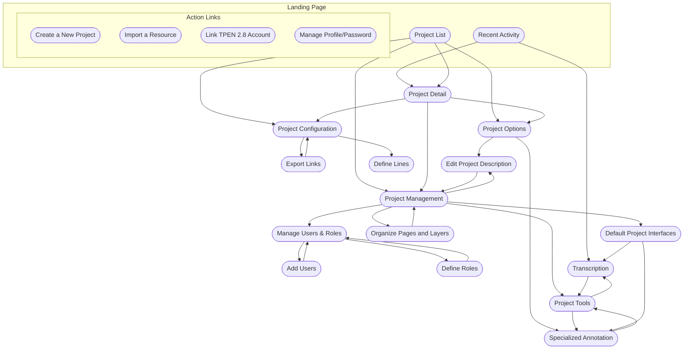

# Core Workflow Interfaces Planning

This page visualizes the core workflow interfaces in the TPEN Application. This is a work in progress and will be updated as the workflow evolves.

> **Note:** Update this chart as new interfaces or workflow steps are defined.
