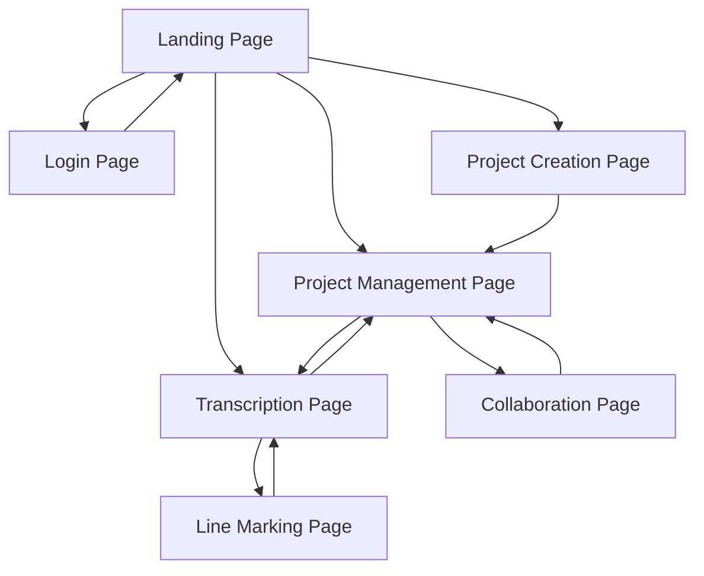

# Release Goals for the July Beta Testing

1. Complete simple transcription workflow
2. Reliable schema for all document types
3. User authentication and invite system
4. User feedback and bug reporting infrastructure
5. Summary punchlist of forthcoming features

## Complete Workflow

Each user should be able to create an account, start their own project, collaborate with others, and add annotations. This is generally illustrated in the TPEN 3.0 Roadmap.

### Account Management

- [ ] New User Account creation
- [ ] Existing User login/logout
- [ ] User Profile management

> *Reach goals:*
>
> - [ ] Link to TPEN 2.0 account
> - [ ] Add external identifier (Google, ORCID, etc.)
> - [ ] Add external authentication (Google, GitHub, etc.)

### Project Management

- [ ] Create a new project
  - [ ] Import from TPEN 2.0
  - [ ] Import from IIIF Manifest 2.x
  - [ ] Import from IIIF Manifest 3.x ([Learn more about IIIF Presentation 3 API](https://iiif.io/api/presentation/3.0/))
- [ ] Add collaborators
  - [ ] Add existing user
  - [ ] Invite a new user
  - [ ] Remove a collaborator
  - [ ] Change roles for collaborators
  - [ ] Create custom roles
- [ ] Add project metadata
- [ ] Reorganize Pages
  - [ ] Remove page
  - [ ] Reorder pages
  - [ ] Add new Layers
- [ ] Continue a Project
  - [ ] See recent Projects
  - [ ] See all Projects
  - [ ] Click to transcribe
  - [ ] Click to manage

> *Reach goals:*
>
> - [ ] Project from Manifest Editor
> - [ ] Project from Image(s) only
> - [ ] Clone Group for new Project
> - [ ] Collect Projects together
> - [ ] Link metadata schemas
> - [ ] Add tags on a Project
> - [ ] Add new Manifests/Pages to Project
> - [ ] Project Changes Log

### Transcription

- [ ] Mark xywh Line Boundaries
- [ ] Add text content to Line
- [ ] Navigate between Lines
- [ ] Navigate between Pages
- [ ] Switch Layers
- [ ] Save progress
- [ ] Show Attribution

> *Reach goals:*
>
> - [ ] Simple autodetect lines
> - [ ] Apply existing Annotations
> - [ ] Linebreak text block
> - [ ] Hotkeys, autotext
> - [ ] Page and Image tools
> - [ ] Splitscreen resources
> - [ ] History/Undo

### Project Preferences

- [ ] Access Project Tools
- [ ] View Default Interfaces (transcription, data export, management, collaboration, sharing)
- [ ] Delete Project

## Interfaces

To support these behaviors, we will need to create a set of interfaces that are easy to use and understand. These interfaces should be designed with the user in mind, and should be intuitive and straightforward to navigate.

## Schemata for Document Types

In addition to the developers own comfort with the data formats, we should be able to describe the types of data we are recording to the user. A document will need to be drafted with them in mind as part of the on-boarding for the beta and possibly for new Users.

### Document Types

- **Project** is the container for all of the data in TPEN. It only exists in the TPEN 3.0 system. Though it has `metadata` and `label` fields, it does not conform to an external standard and is only meant for use within TPEN Interfaces. Importantly, a Project contains the `collaborators`, listing the owner and other user roles; the `layers` which contain references to all the user-created data, including annotations; and a variety of other bookkeeping fields for attributing source documents, configuration, and associated tools.

- **Layer** is a set of related Annotations in a specified order. Pages within a Layer are a nonexclusive subset of all the Pages in the Project that share a cohesive purpose like "base text", "music", "commentary", etc. Layers do not follow an external standard, but are represented by **Annotation Collection** documents saved on RERUM (https://store.rerum.io).

- **Page** is a single image and its transcription annotations. Pages are organized into Layers and are usually one to each image in the digitized resource. Pages are represented by **Annotation Page** documents saved on RERUM (https://store.rerum.io). If, for example, a folio image has both a base text and commentary on it, that would usually be split into two Pages, one for each Layer and populated with Annotations targeting the same resource.

- **Manifest** is used to start a Project or as a static export format for Project data. The static export will always be a JSON-LD file as the IIIF Manifest 3.x format ([Learn more about IIIF Presentation 3 API](https://iiif.io/api/presentation/3.0/)).

> *Development Note:*
> The TPEN Services repository has an API (api.t-pen.org) that can be used to create and manage Projects, Layers, and Pages. It does not store data locally in the same format that TPEN Interfaces uses. In several areas, the code may seem to refer to type of document which is does not. For example, a Project-for-Interface includes aggregated data that is not required for a Project-for-API.

## User Authentication and Invite System

Anyone with an email address should be able to create an account. This will be the first step in the onboarding process. When users wish to collaborate, they will be able to invite others to join their Project. The system will automatically send an email to the invited user with a link to create an account. Once the invited user has created an account, they will be able to access the Project.

## User Feedback and Bug Reporting Infrastructure

Users should be able to report bugs and provide feedback on the system. This will be done through a simple form that will be accessible from any page. The form will automatically record the user's information and the page they were on when they submitted the form. This will help us to track down bugs and improve the system.
The form will also allow users to provide feedback on the system, including suggestions for new features and improvements.

- [ ] Create a feedback form
- [ ] Create a bug report form
- [ ] Link form submissions to GitHub issues
- [ ] Create a user feedback dashboard

**Reach goals:**

- [ ] Create a user feedback forum
- [ ] Create a user feedback voting system
- [ ] Create a user feedback leaderboard

## Summary Punchlist of Forthcoming Features

Who knows? We'll populate this as we get closer and meet with the advisory board. The goal is to have a list of features that we can work on after the beta testing is complete. This will help us to prioritize our work and ensure that we are meeting the needs of our users.
