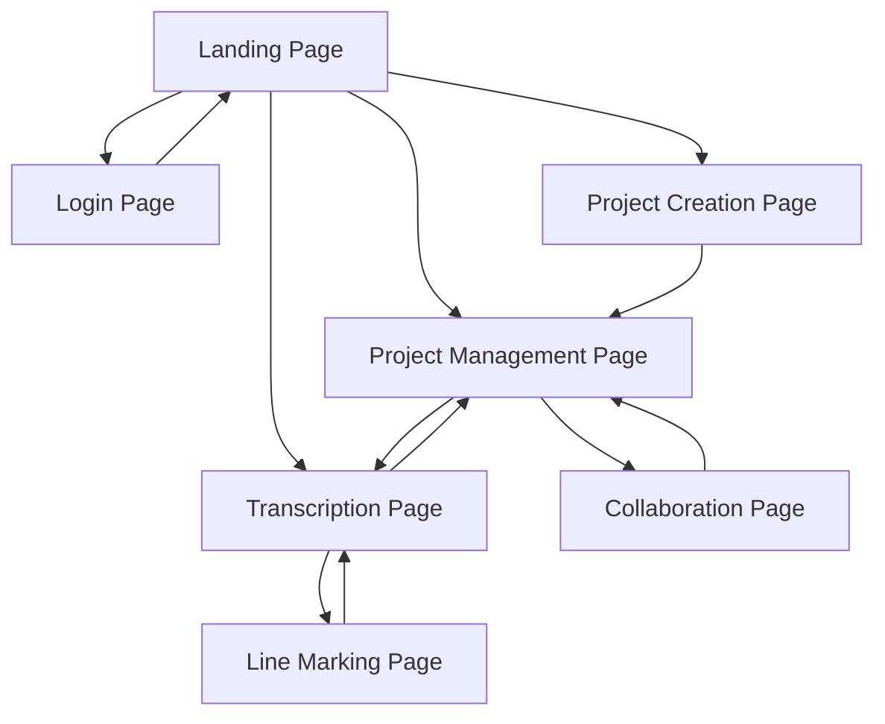

# Release Goals for the July Beta Testing

1.	Complete simple transcription workflow
2.	Reliable schema for all document types
3.	User authentication and invite system
4.	User feedback and bug reporting infrastructure
5.	Summary punchlist of forthcoming features

## Complete Workflow

Each user should be able to create an account, start their own project, collaborate with others, and add annotations. This is generally illustrated in the TPEN 3.0 Roadmap.

### Account Management

- [ ] New User Account creation
- [ ] Existing User login/logout
- [ ] User Profile management

> *Reach goals:*
> 
> - [ ] Link to TPEN 2.0 account
> - [ ] Add external identiier (Google, ORCID, etc.)
> - [ ] Add external authentication (Google, GitHub, etc.)

### Project Management

- [ ] Create a new project
    - [ ] Import from TPEN 2.0
    - [ ] Import from IIIF Manifest 2.x
    - [ ] Import from IIIF Manifest 3.x
- [ ] Add collaborators
    - [ ] Add existing user
    - [ ] Invite a new user
    - [ ] Remove a collaborator
    - [ ] Change roles for collaborators
    - [ ] Create custom roles
- [ ] Add project metadata
- [ ] Reorganize Pages
    - [ ] Remove page
    - [ ] Reorder pages
    - [ ] Add new Layers
- [ ] Continue a Project
    - [ ] See recent Projects
    - [ ] See all Projects
    - [ ] Click to transcribe
    - [ ] Click to manage

> *Reach goals:*
>
> - [ ] Project from Manifest Editor
> - [ ] Project from Image(s) only
> - [ ] Clone Group for new Project
> - [ ] Collect Projects together
> - [ ] Link metadata schemas
> - [ ] Add tags on a Project
> - [ ] Add new Manifests/Pages to Project
> - [ ] Project Changes Log

### Transcription

- [ ] Mark xywh Line Boundaries
- [ ] Add text content to Line
- [ ] Navigate between Lines
- [ ] Navigate between Pages
- [ ] Switch Layers
- [ ] Save progress
- [ ] Show Attribution

> *Reach goals:*
>
> - [ ] Simple autodetect lines
> - [ ] Apply existing Annotations
> - [ ] Linebreak text block
> - [ ] Hotkeys, autotext
> - [ ] Page and Image tools
> - [ ] Splitscreen resources
> - [ ] History/Undo

### Project Management

- [ ] Access Project Tools
- [ ] View Default Interfaces (transcription, data export, management, collaboration, sharing)
- [ ] Delete Project

## Interfaces

To support these behaviors, we will need to create a set of interfaces that are easy to use and understand. These interfaces should be designed with the user in mind, and should be intuitive and straightforward to navigate.

