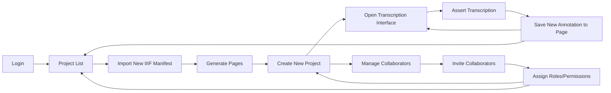
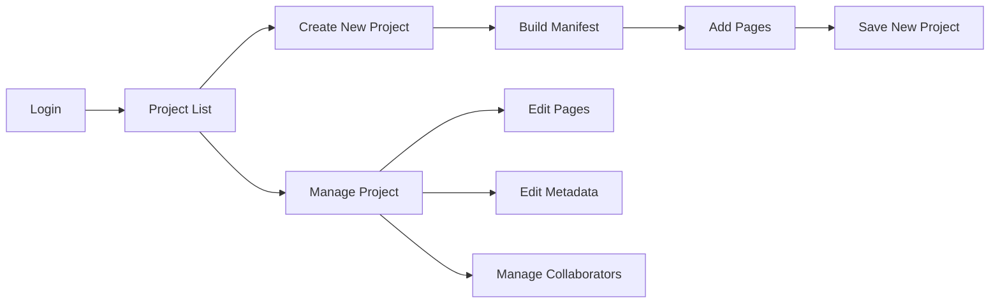

## Expected Development Timeline

The funding period for TPEN 3.0 is from 2024-2026. The development will take 
place in three phases:

1. **Phase 1: 2024**
    - **New platform design**
    - **Project creation and management**
    - **Interfaces and Workflows**
2. **Phase 2: July 2025**
    - **Public Beta**
    - **User feedback and improvements**
    - **Test cases and focused features**
3. **Phase 3: March 2026**
    - **Training and documentation**
    - **Migration from TPEN 2.8**
    - **Community Demonstrations and Feedback**
    - **Launch of TPEN 3.0 (December 2026)**

As each of these phases are completed, this page will be updated with the 
latest information on the development progress and the expected features of 
the new platform.

## Phase 1: 2024

---

> *1. Evaluate and select a technology stack for data management and user 
> interface.*

The team considered several options, focusing on familiarity, scalability, 
and longevity. There is a strong preference for open-source technologies and 
a commitment to standards compliance. Where possible, the team will reduce 
dependencies on libraries and frameworks that would require ongoing 
maintenance.

### TPEN Services

The API backbone of the TPEN platform includes the required configuration and 
account data, as well as the ability to create, edit, and delete projects. 
The API will be designed to be as flexible as possible, allowing for the 
proliferation or integration of third-party tools and services.

Private user account information and project configurations will be stored in 
a private MongoDB database managed on premises. User authentication is 
handled by Auth0 and an idToken recovery service allows external applications 
to authenticate users with TPEN without a backend server.

The [TPEN API](/api#content) is available for any developer to use with the 
idToken granting access to appropriate user actions. The API services run on 
a Node.js server and are available for use with any client-side application. 
Code is developed in the open and contributions are welcome at the 
[TPEN GitHub repository](https://github.com/CenterForDigitalHumanities/TPEN-services).

### TPEN Interfaces

The user interface for TPEN 3.0 is intended to be as simple and modular as 
possible. For all core interfaces, we will use ES6 JavaScript with Web 
Components instead of a framework like React or Angular. This will allow for 
more durability and flexibility in the long term. Contributions from the 
community do not have to be so rigorously controlled and the TPEN 3 
experience will differ from TPEN 2 in that it will encourage a diversity of 
tools built for the specific projects and workflows of the users.

> **Guiding Principle**: The TPEN 3.0 interfaces are designed to be as simple, 
> unstyled, and unopinionated as possible. As most of the content is available 
> without authentication, it should be easy to design an interface for 
> exhibiting project data in a variety of ways, with authentication only 
> required for editing.

The [GitHub repository](https://github.com/CenterForDigitalHumanities/TPEN-interfaces) 
for the TPEN interfaces is used directly for core components and as a template 
for new projects. In support of developers, there is a [well-documented set of 
Interface Classes](https://inurface.t-pen.org/classes/) that can be used to 
build new components and interfaces.

---

> *2. Enable the creation and management of projects built from IIIF standard 
> resources.*

### IIIF Manifests

During the first phase of development, we rely on the [IIIF Presentation 
API](https://iiif.io/api/presentation/3.0/) to initialize projects. Though in 
some cases the version 2.1 API is still used, the team is committed to the 
3.x standard and upgrades all incoming resources where possible. By the end 
of this phase, it will be trivial to start a new project by simply providing 
a URL to a IIIF manifest.

> **Guiding Principle**: The TPEN tool is non-destructive and respects the 
> integrity of the original resources. Wherever possible, the project content 
> is pointed to the original resources through annotation and reference.

### Collaboration

Any TPEN User can create a project and invite others to collaborate. Whoever 
creates a project is the Owner and all projects must have exactly one Owner. 
In addition to the Owner, a project may have any number of Leaders and 
Contributors. All User Roles are per Project and 
[Custom Roles](/documentation/2024/12/12/roles-permissions.html) are allowed.

Our Project Management interactions have been proved out and are available on
GitHub. The `Project` Class in `TPEN-interfaces` [includes helpful methods](https://app.t-pen.org/classes/Project#methods) for adding and removing members, assigning roles, 
and setting custom roles and permissions.

---

> *3. Develop a set of core interfaces and workflows for project creation,
> annotation, and transcription.*

### Workflows

TPEN 3.0 is built around modularity and flexibility but the core workflows 
emulate the existing functionality of the TPEN 2.8 platform. In Phase 1, we 
aim to allow a full end-to-end workflow for a single project, reserving 
advanced features and integrations for later phases.

#### End-to-End (Simplest Case)

This is the first target workflow for TPEN 3.0. The user logs in, creates a
project, invites collaborators, transcribes a page, and saves the annotation.
The user can then return to the project list to start a new project or 
continue working on the current project.

This simplest case was originally planned for December 2024 but has not been 
completed. It is required for the planned public Beta and is considered ASAP.

#### Project creation and management

This workflow covers the basic project requirements for the Beta release. 
In addition to a new project from a IIIF Manifest link, this workflow allows 
for the creation of a new project from scratch. The user can add pages, edit 
metadata, and manage collaborators. An external or forked Manifest Builder may 
be called for, but in general, the user should be able to create a project 
from a set of images that they provide. This hole is very deep and we may 
ultimately offer lots of options like create from TEI/XML or upload private images 
to a GitHub repository, but these are for consideration after the Beta.

Any Project should be able to be managed by the Owner and any Leaders. The 
relationship between the Manifest and the Project will be carefully managed 
to honor the original document, even when we build it ourselves. The Pages 
become important to track well, as they are the primary unit of work in TPEN.
    