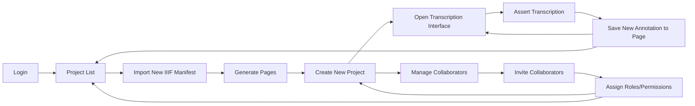
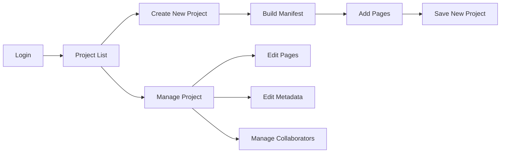
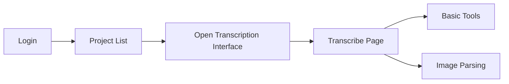

## Expected Development Timeline

The funding period for TPEN 3.0 is from 2024-2026. The development will take 
place in three phases:

1. **Phase 1: 2024**
    - **New platform design**
    - **Project creation and management**
    - **Interfaces and Workflows**
2. **Phase 2: July 2025**
    - **Public Beta**
    - **User feedback and improvements**
    - **Test cases and focused features**
3. **Phase 3: March 2026**
    - **Training and documentation**
    - **Migration from TPEN 2.8**
    - **Community Demonstrations and Feedback**
    - **Launch of TPEN 3.0 (December 2026)**

As each of these phases are completed, this page will be updated with the 
latest information on the development progress and the expected features of 
the new platform.

## Phase 1: 2024

Establish the foundation for the new platform, including the technology stack,
data management, and user interface. Develop a set of core interfaces and 
workflows for project creation, annotation, and transcription.

---

> *1. Evaluate and select a technology stack for data management and user 
> interface.*

The team considered several options, focusing on familiarity, scalability, 
and longevity. There is a strong preference for open-source technologies and 
a commitment to standards compliance. Where possible, the team will reduce 
dependencies on libraries and frameworks that would require ongoing 
maintenance.

### TPEN Services

The API backbone of the TPEN platform includes the required configuration and 
account data, as well as the ability to create, edit, and delete projects. 
The API will be designed to be as flexible as possible, allowing for the 
proliferation or integration of third-party tools and services.

Private user account information and project configurations will be stored in 
a private MongoDB database managed on premises. User authentication is 
handled by Auth0 and an idToken recovery service allows external applications 
to authenticate users with TPEN without a backend server.

The [TPEN API](/api#content) is available for any developer to use with the 
idToken granting access to appropriate user actions. The API services run on 
a Node.js server and are available for use with any client-side application. 
Code is developed in the open and contributions are welcome at the 
[TPEN GitHub repository](https://github.com/CenterForDigitalHumanities/TPEN-services).

### TPEN Interfaces

The user interface for TPEN 3.0 is intended to be as simple and modular as 
possible. For all core interfaces, we will use ES6 JavaScript with Web 
Components instead of a framework like React or Angular. This will allow for 
more durability and flexibility in the long term. Contributions from the 
community do not have to be so rigorously controlled and the TPEN 3 
experience will differ from TPEN 2 in that it will encourage a diversity of 
tools built for the specific projects and workflows of the users.

> **Guiding Principle**: The TPEN 3.0 interfaces are designed to be as simple, 
> unstyled, and unopinionated as possible. As most of the content is available 
> without authentication, it should be easy to design an interface for 
> exhibiting project data in a variety of ways, with authentication only 
> required for editing.

The [GitHub repository](https://github.com/CenterForDigitalHumanities/TPEN-interfaces) 
for the TPEN interfaces is used directly for core components and as a template 
for new projects. In support of developers, there is a [well-documented set of 
Interface Classes](https://inurface.t-pen.org/classes/) that can be used to 
build new components and interfaces.

---

> *2. Enable the creation and management of projects built from IIIF standard 
> resources.*

### IIIF Manifests

During the first phase of development, we rely on the [IIIF Presentation 
API](https://iiif.io/api/presentation/3.0/) to initialize projects. Though in 
some cases the version 2.1 API is still used, the team is committed to the 
3.x standard and upgrades all incoming resources where possible. By the end 
of this phase, it will be trivial to start a new project by simply providing 
a URL to a IIIF manifest.

> **Guiding Principle**: The TPEN tool is non-destructive and respects the 
> integrity of the original resources. Wherever possible, the project content 
> is pointed to the original resources through annotation and reference.

### Collaboration

Any TPEN User can create a project and invite others to collaborate. Whoever 
creates a project is the Owner and all projects must have exactly one Owner. 
In addition to the Owner, a project may have any number of Leaders and 
Contributors. All User Roles are per Project and 
[Custom Roles](/documentation/2024/12/12/roles-permissions.html) are allowed.

Our Project Management interactions have been proved out and are available on
GitHub. The `Project` Class in `TPEN-interfaces` [includes helpful methods](https://app.t-pen.org/classes/Project#methods) for adding and removing members, assigning roles, 
and setting custom roles and permissions.

---

> *3. Develop a set of core interfaces and workflows for project creation,
> annotation, and transcription.*

### Workflows

TPEN 3.0 is built around modularity and flexibility but the core workflows 
emulate the existing functionality of the TPEN 2.8 platform. In Phase 1, we 
aim to allow a full end-to-end workflow for a single project, reserving 
advanced features and integrations for later phases.

#### End-to-End (Simplest Case)

This is the first target workflow for TPEN 3.0. The user logs in, creates a
project, invites collaborators, transcribes a page, and saves the annotation.
The user can then return to the project list to start a new project or 
continue working on the current project.

This simplest case was originally planned for December 2024 but has not been 
completed. It is required for the planned public Beta and is considered ASAP.

#### Project creation and management

This workflow covers the basic project requirements for the Beta release. 
In addition to a new project from a IIIF Manifest link, this workflow allows 
for the creation of a new project from scratch. The user can add pages, edit 
metadata, and manage collaborators. An external or forked Manifest Builder may 
be called for, but in general, the user should be able to create a project 
from a set of images that they provide. This hole is very deep and we may 
ultimately offer lots of options like create from TEI/XML or upload private images 
to a GitHub repository, but these are for consideration after the Beta.

Any Project should be able to be managed by the Owner and any Leaders. The 
relationship between the Manifest and the Project will be carefully managed 
to honor the original document, even when we build it ourselves. The Pages 
become important to track well, as they are the primary unit of work in TPEN.

#### Transcription and Annotation

The Transcription Interface is the primary tool for the user to interact with 
the project. The user can transcribe the text on the page, add annotations, 
and save the work. For the Beta, we are focusing on the basic tools and 
features required to transcribe a page:

- **Text Entry**: The user can type text into a text box and it is saved to 
  the Page. At this point, we do not need to support multiple Layers, but a 
  Page will definitely have multiple lines.
- **Image Parsing**: The user can see the image of the page and draw boxes 
  around the text to be transcribed. This will be a place to attach many 
  options in the future, such as computer vision and external tools, but for 
  the Beta, we are focusing on the user's ability to draw boxes as in 2.8.
- **Basic Tools**: Split screen tools are part of TPEN's history, so it is 
  likely there will be some similar interfaces in the future. For the Beta, 
  a single tool offering a preview of the transcription and the ability to 
  navigate the page by clicking on a text line is sufficient.

These changes should all be saved in the Page and Layer objects, which are 
`Annotation Collection`s and `Annotation Page`s annotated onto the `Canvas` 
and `Manifest` objects. All these also belong in RERUM, which is our first 
big push to make TPEN 3.0 more interoperable. In the future, these interactions 
may be more complicated, with a caching layer or sockets to keep from hammering 
RERUM with minor updates, so anything we are doing now should include at least 
a minor abstraction to allow for that.

## Phase 2: July 2025

The Beta release is the first opportunity for the public to interact with the 
new platform. The Advisory Board members and Research Assistants will be the 
first to test the platform, followed by a wider group of test users. The Beta 
includes periods of feedback and focused features to improve the platform, 
which will be used to prioritize work for the final release.

---

> *1. Public Beta enabling Advisory Board members, Research Assistants, and test users to create and interact with simple Projects.*

The release of the Beta is a major milestone for the project. Launching it 
requires a stable platform with a set of core features that are ready for 
testing. We should also have drafted our license and terms of service before 
inviting members of the public to use the platform. A direct feedback tool 
should be evaluated and included before the Beta release.

Expectations for the users and their data should be set before the Beta. As 
a guide, we should acknowledge that we will attempt to preserve the data but 
that changes to structure may render it unusable or the formal launch may 
require us to reset the database. We should also be clear about the licensing 
specifically in the case of the Beta, as we will regularly dig into users' 
contributions and activity to improve the platform. This may be something a 
User could opt out of in a final product.

---

> *2. User feedback and improvements to the platform.*

There are scheduled meetings for feedback from the Advisory Board which will 
select a subset of features to focus on for the final release. Some features, 
per the funding proposal, are required for the final release and others are 
simply proposed as possible and will be scheduled for work after delivery. It 
is up to the Advisory Board to decide which features are most impactful.

Users will also provide feedback and there should be a combination of simple 
ways to do this. Some GitHub issue templates will help, but there should also 
be a persistent feedback tool on each interface. Contact via email or forms 
must be easy to access and regularly reviewed.

---

> *3. Test cases and focused features based on feedback and recommendations.*

There are three main ways to prioritize work for the final release:

1. **Required Features**: These are features that are required for the final 
   release. They are the most important and will be prioritized first. As a 
   rule of thumb, any feature not carried forward from TPEN 2.8 must be 
   intentionally left behind. The features named in the proposal may be listed 
   here later as well.

2. **Advisory Board Features**: These are features that the Advisory Board 
   has selected as important for the final release. They are the next most 
   important and will be prioritized second. The Advisory Board will meet 
   regularly to discuss the progress and provide feedback.

3. **User Features**: These are features that users have requested or that 
   fulfill the special cases of the test users. Some may be simply selected 
   by the developers, but no feature should be added without a clear use case.

## Phase 3: March 2026

The final phase of development focuses on training and documentation, 
migration from TPEN 2.8, community demonstrations, and feedback. The launch 
of TPEN 3.0 is scheduled for December 2026.

---

> *1. Training and documentation for users and developers.*

The training and documentation for TPEN 3.0 will be available on the website 
and integrated into the core interfaces. The documentation will be written 
with the user in mind, providing clear instructions and examples for common 
tasks. 

Developer guidance will include blog posts and code documentation, as well as
a set of examples for building custom interfaces and workflows. The core 
interfaces themselves should be well-documented and serve as a template for 
new projects.

It is possible a workshop may be held to introduce the new platform to the 
community. This would be a good opportunity to gather feedback and provide 
hands-on training for users and developers.

---

> *2. Migration from TPEN 2.8 to TPEN 3.0.*

The data models of TPEN 2.8 and TPEN 3.0 are not compatible, so a migration 
tool will be developed to move projects and annotations from the old platform 
to the new one. The migration tool will be available to all users and will 
be supported by the TPEN team. Users should only opt into the migration, and 
it may be kept to a project-at-a-time basis to prevent moving forward stale or 
empty projects.

Eventually, creating new projects on TPEN 2.8 will be disabled and all users 
will be required to migrate to TPEN 3.0. A new TPEN user may have a TPEN 2.8 
account, but the projects are not linked directly. When TPEN 2.8 is eventually 
end-of-life, the projects may all be exported to a static manifest to carry forward.

---

> *3. Community Demonstrations and Feedback.*

The TPEN team will host a series of community demonstrations to showcase the 
new platform and gather feedback from users. These demonstrations will be 
at public conferences like the IIIF annual meeting and the SMRS conference. 
Additionally, the team will consider webinars or in-person workshops to 
introduce the platform to a wider audience, though this will largely happen 
after the launch and outside of the funding period.

---

> *4. Launch of TPEN 3.0 (December 2026).*

The launch of TPEN 3.0 is scheduled for December 2026. The platform will be 
available to the public and delivered as a stable, feature-complete product. 
All relevant materials will be submitted as deliverables to the funders and 
the platform will be maintained by the TPEN team for the foreseeable future.

After launch, the project will be configured as an open-source project, 
solliticing contributions from the community. The TPEN team will continue to 
develop the platform and provide support for users and developers. The data 
will be maintained and backed up regularly, with a plan for long-term 
preservation and sustainability.
